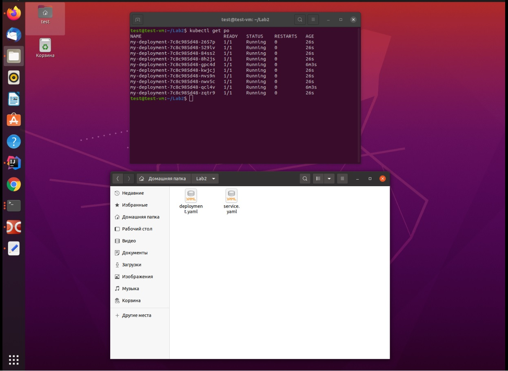
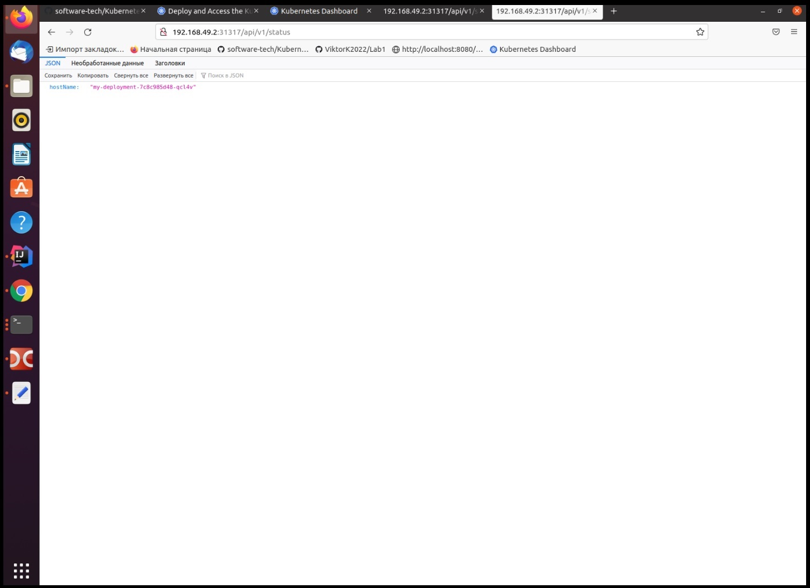
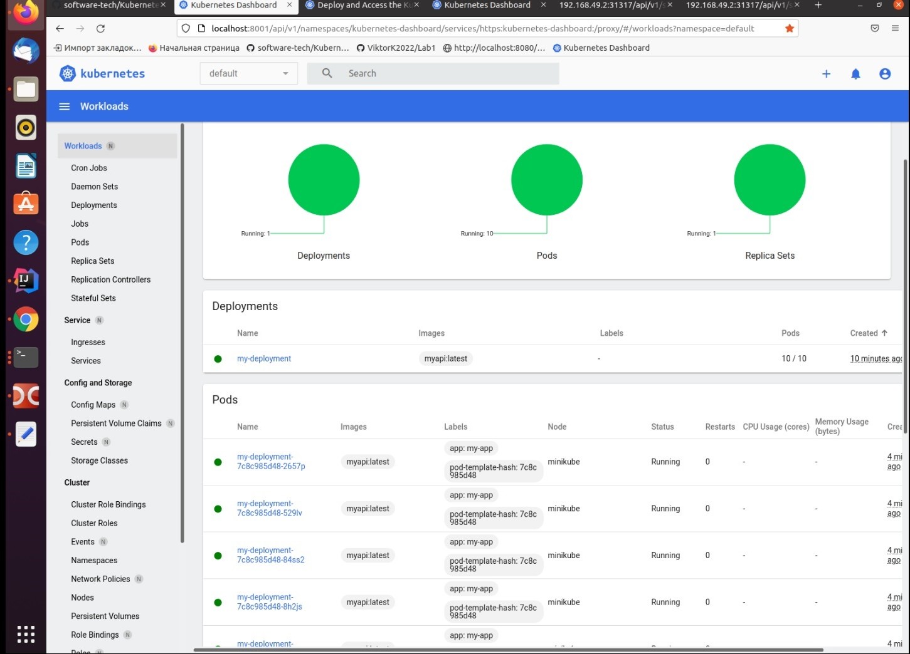
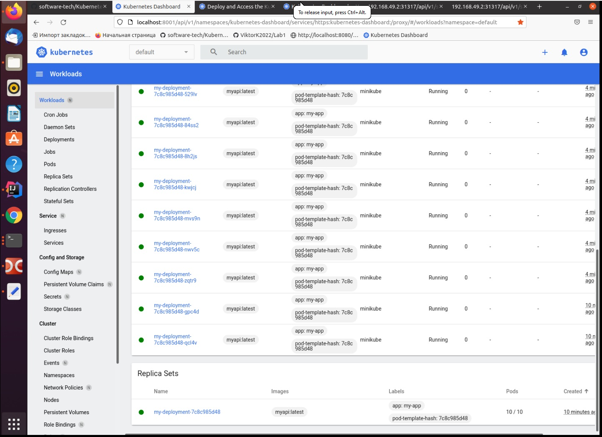

**Название дисциплины:** Технологии разработки программного обеспечения.

**Название лабораторной работы:** Cоздание кластера Kubernetes и деплой приложения.

**ФИО:**  Кухарский Виктор Александрович.

**Группа:**  МАС2131.

**Цель лабораторной работы:** Знакомство с кластерной архитектурой на примере Kubernetes, а также деплоем приложения в кластер.

___
### **Отчет о проделанной работе**

* **Манифест deployment.yaml:** 

        apiVersion: apps/v1
        kind: Deployment
        metadata:
          name: my-deployment
        spec:
          replicas: 10
          selector:
            matchLabels:
              app: my-app
          strategy:
            rollingUpdate:
              maxSurge: 1
              maxUnavailable: 1
            type: RollingUpdate
          template:
            metadata:
              labels:
                app: my-app
            spec:
              containers:
                - image: myapi:latest
                  imagePullPolicy: Never 
                  name: myapi
                  ports:
                    - containerPort: 8080
              hostAliases:
              - ip: "192.168.49.1" # The IP of localhost from MiniKube
                hostnames:
                - postgres.local
                
* **Манифест service.yaml:** 

        apiVersion: v1
        kind: Service
        metadata:
          name: my-service
        spec:
          type: NodePort
          ports:
            - nodePort: 31317
              port: 8080
              protocol: TCP
              targetPort: 8080
          selector:
            app: my-app                
           
* **Скриншты вывода команды `kubectl get po` в консоли:**

​

​

* **Скриншоты графического интерфейса c изображением под:**
* 
​

​

